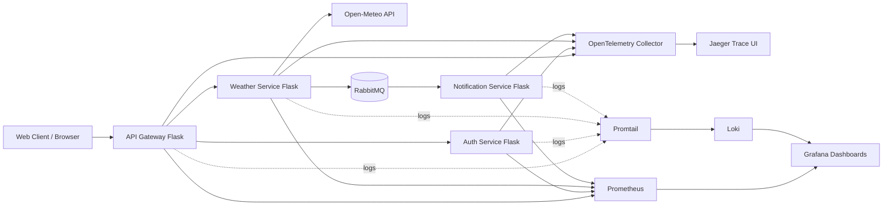

# Architecture Diagram

## Communication Design

- Synchronous: API Gateway -> Auth Service and Weather Service via REST.
- Asynchronous: Weather Service -> Notification Service via RabbitMQ queue `weather.events`.
- Security: JWT-based authentication and token verification via Auth Service.
- Fault tolerance: retry strategy in API Gateway; queue durability in RabbitMQ.
